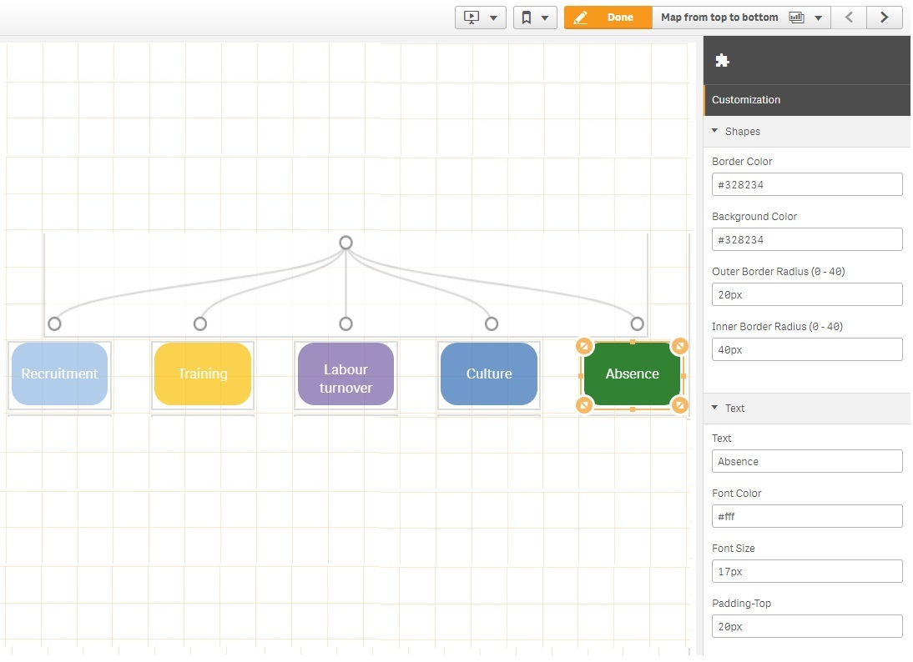

# ShapeAndText - QS extension

it's a nice QlikSense extension which allows you to:

* A. Create your own custom shapes.
* B. Add a Text and choose the font color and font size.

And you can insert a shape and type text in it as the example below.

## License

* © Copyright 2019 - SharifKhlief
